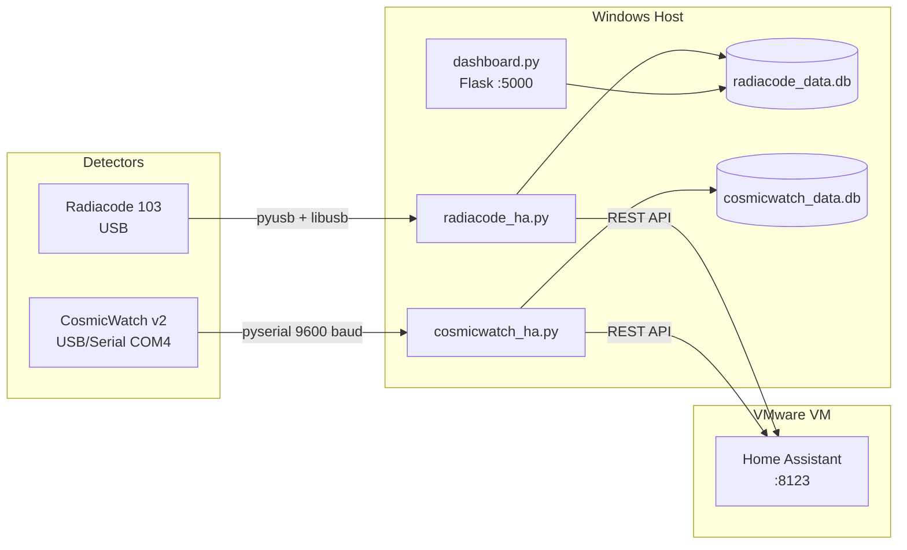
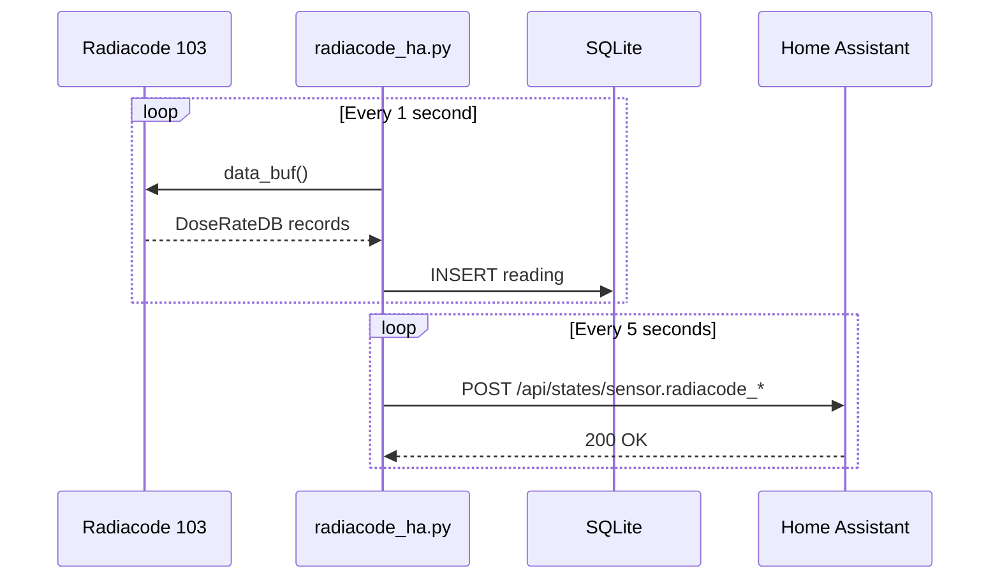
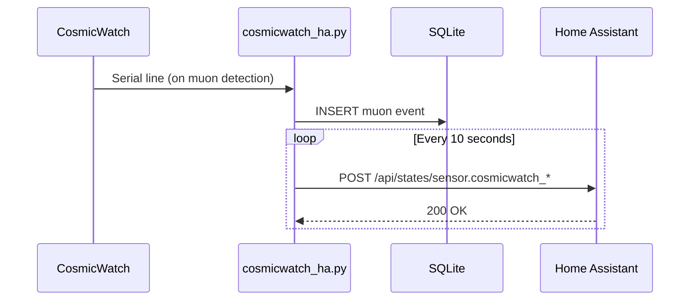
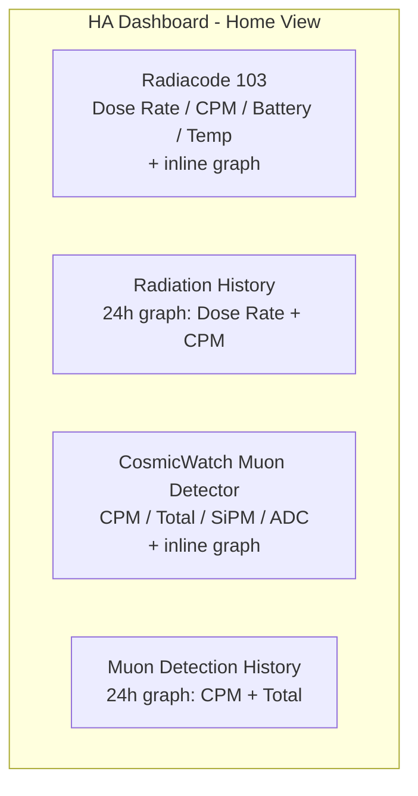

# Radiation & Particle Monitoring Station

A Windows-based monitoring station that collects data from a **Radiacode 103** radiation detector and a **CosmicWatch Desktop Muon Detector v2**, pushes real-time sensor data to **Home Assistant**, and stores all readings in local **SQLite** databases with a **Flask** web dashboard. This will need to be adapted for it to work on your machine. This is bespoke to its current env

## Architecture



## Data Flow





## Project Structure

```
D:\repo\Radiacode\
    radiacode_ha.py           # Radiacode bridge (main script)
    dashboard.py              # Flask web dashboard for Radiacode data
    config.yaml               # Radiacode config (HA URL, token, intervals)
    requirements.txt          # Python deps for Radiacode bridge
    start_radiacode.bat       # Manual start script

    cosmicwatch/
        cosmicwatch_ha.py     # CosmicWatch bridge (main script)
        config.yaml           # CosmicWatch config (COM port, baud, HA token)
        requirements.txt      # Python deps for CosmicWatch bridge
        CosmicWatch_Serial/
            CosmicWatch_Serial.ino  # Minimal Arduino sketch (serial-only)

    # Generated at runtime (not in git):
    radiacode_data.db         # SQLite DB with radiation readings
    radiacode_ha.log          # Rotating log file
    cosmicwatch/
        cosmicwatch_data.db   # SQLite DB with muon events
        cosmicwatch_ha.log    # Rotating log file
```

## Components

### Radiacode 103 Bridge (`radiacode_ha.py`)

Reads radiation data from the Radiacode 103 via USB using the [`radiacode`](https://github.com/cdump/radiacode) Python library.

**Key details:**
- Polls device every **1 second** via `device.data_buf()`
- Uses `DoseRateDB` records (arrive ~every 1-5s from device)
- Dose rate conversion: raw value is in **R/h** (Roentgens/hour); multiply by **10,000** to get **uSv/h**
- Battery `charge_level` from library is already in percent (0-100), no multiplication needed
- Pushes to HA every **5 seconds**
- Stores every reading to SQLite
- USB reset on reconnect to recover from stuck states
- Requires **WinUSB driver** (installed via [Zadig](https://zadig.akeo.ie/)) replacing the default Phyton driver

**HA Sensors:**

| Entity ID | Unit | Description |
|-----------|------|-------------|
| `sensor.radiacode_dose_rate` | uSv/h | Ambient radiation dose rate |
| `sensor.radiacode_cpm` | CPM | Counts per minute |
| `sensor.radiacode_battery` | % | Device battery level |
| `sensor.radiacode_temperature` | C | Device temperature |

**SQLite Schema (`readings` table):**

| Column | Type | Description |
|--------|------|-------------|
| timestamp | TEXT | ISO 8601 UTC |
| dose_rate_usv | REAL | Dose rate in uSv/h |
| cpm | REAL | Counts per minute |
| temperature | REAL | Device temp (C) |
| battery | REAL | Battery (%) |

### CosmicWatch Bridge (`cosmicwatch/cosmicwatch_ha.py`)

Reads muon detection events from a CosmicWatch Desktop Muon Detector v2 via serial (USB CH340).

**Key details:**
- Listens on **COM4** at **9600 baud**
- Arduino sends one line per muon event: `count timestamp_ms adc sipm_mV deadtime_ms temperature_C`
- Calculates **CPM** from a running event window
- Tracks **cumulative total** from SQLite row count (persists across restarts)
- Pushes to HA every **10 seconds**
- Auto-detects CH340 USB-serial adapter if port not configured

**HA Sensors:**

| Entity ID | Unit | Description |
|-----------|------|-------------|
| `sensor.cosmicwatch_cpm` | CPM | Muon detection rate |
| `sensor.cosmicwatch_total` | events | Cumulative muon count (persists) |
| `sensor.cosmicwatch_sipm` | mV | Last SiPM peak voltage |
| `sensor.cosmicwatch_adc` | ADC | Last raw ADC value (0-1023) |

**SQLite Schema (`muon_events` table):**

| Column | Type | Description |
|--------|------|-------------|
| timestamp | TEXT | ISO 8601 UTC |
| event_num | INTEGER | Arduino's running count |
| ardn_time_ms | INTEGER | Arduino uptime (ms) |
| adc | INTEGER | Raw ADC value |
| sipm_mv | REAL | SiPM voltage (mV) |
| deadtime_ms | REAL | Cumulative deadtime (ms) |
| temperature | REAL | Detector temperature (C) |

### Arduino Sketch (`CosmicWatch_Serial.ino`)

Minimal firmware for the CosmicWatch's Arduino Nano. Replaces the stock SDCard/OLED sketches.

- **19% flash**, **15% RAM** (very lightweight)
- Detects muon events when `analogRead(A0) > 50` (SIGNAL_THRESHOLD)
- Outputs space-delimited data over serial at 9600 baud
- Uses 12th-order polynomial calibration for ADC-to-SiPM voltage conversion
- LED flashes on each detection
- Reads detector name from EEPROM

### Web Dashboard (`dashboard.py`)

Flask web app serving charts at `http://localhost:5000`.

- **Dose Rate** and **CPM** time-series charts (Chart.js)
- Summary statistics (min/max/avg)
- Time range selector (1H, 6H, 24H, 7D, 30D)
- CSV export
- Auto-refreshes every 30 seconds

## Setup

### Prerequisites

- Windows 10/11
- Python 3.9+ with pip
- Radiacode 103 connected via USB
- CosmicWatch v2 connected via USB
- Home Assistant accessible on the LAN

### Installation

```bash
cd D:\repo\Radiacode

# Install Python dependencies
pip install -r requirements.txt
pip install -r cosmicwatch/requirements.txt

# Configure
# Edit config.yaml and cosmicwatch/config.yaml with your HA long-lived access token
# Get token from: http://homeassistant.local:8123/profile/security
```

### Radiacode USB Driver

The Radiacode uses a proprietary "Phyton" USB driver by default. For `pyusb` to communicate with it, replace with WinUSB using [Zadig](https://zadig.akeo.ie/):

1. Download and run Zadig
2. Options > List All Devices
3. Select "Phyton USB Device" (VID 0483, PID F123)
4. Target driver: WinUSB
5. Click "Replace Driver"

> **Note:** This disables the official Radiacode Windows app. Restore via Device Manager > Update Driver > Search Automatically.

### Flash CosmicWatch Firmware

```bash
# Using Arduino IDE CLI (1.8.x)
"C:\Program Files (x86)\Arduino\arduino_debug.exe" \
    --board arduino:avr:nano:cpu=atmega328 \
    --port COM4 \
    --upload cosmicwatch/CosmicWatch_Serial/CosmicWatch_Serial.ino
```

### Running

```bash
# Start Radiacode bridge
python radiacode_ha.py

# Start CosmicWatch bridge (separate terminal)
python cosmicwatch/cosmicwatch_ha.py

# Start web dashboard (separate terminal)
python dashboard.py
```

### Autostart

Both bridges are configured to start automatically on Windows login via Start Menu shortcuts:

```
%APPDATA%\Microsoft\Windows\Start Menu\Programs\Startup\
    RadiacodeHA.lnk      -> pythonw.exe radiacode_ha.py
    CosmicWatchHA.lnk    -> pythonw.exe cosmicwatch/cosmicwatch_ha.py
```

They run headlessly via `pythonw.exe` with output going to log files.

## Home Assistant Dashboard

The following cards are added to the default Lovelace dashboard:



All sensors use `state_class: measurement` (or `total_increasing` for cumulative total), enabling HA's **long-term statistics** (hourly min/mean/max recorded indefinitely).

## Configuration

### `config.yaml` (Radiacode)

```yaml
homeassistant:
  url: http://homeassistant.local:8123
  token: YOUR_LONG_LIVED_ACCESS_TOKEN

radiacode:
  serial_number: null           # null = first USB device
  ha_push_interval_seconds: 5

logging:
  level: INFO
  file: radiacode_ha.log        # null = console only
```

### `cosmicwatch/config.yaml`

```yaml
homeassistant:
  url: http://homeassistant.local:8123
  token: YOUR_LONG_LIVED_ACCESS_TOKEN

cosmicwatch:
  port: COM4                    # null = auto-detect CH340
  baud: 9600
  ha_push_interval_seconds: 10

logging:
  level: INFO
  file: cosmicwatch_ha.log
```

## Troubleshooting

| Issue | Solution |
|-------|----------|
| Radiacode: "No backend available" | Install `libusb-package`: `pip install libusb-package` |
| Radiacode: "Device not found" | Check Zadig WinUSB driver is installed for VID 0483 PID F123 |
| Radiacode: data_buf() returns empty | USB device may be stuck. Script auto-resets USB on reconnect |
| Radiacode: dose_rate seems wrong | Raw value is in R/h, must multiply by 10,000 for uSv/h |
| CosmicWatch: no events | Check LED is blinking. If not, reflash the Arduino sketch |
| CosmicWatch: "Access denied" on COM port | Another process has the port open. Kill stale pythonw processes |
| HA: sensors not appearing | Check token is valid. Sensors auto-create on first POST |
| HA: total muons stuck | Fixed: cumulative total loads from DB row count on restart |

## Storage Estimates

Radiacode (~1 row/second):

| Period | Rows | Size |
|--------|------|------|
| Day | ~86,400 | ~10 MB |
| Month | ~2.6M | ~300 MB |
| Year | ~31.5M | ~3.6 GB |

CosmicWatch (~30 events/minute):

| Period | Rows | Size |
|--------|------|------|
| Day | ~43,200 | ~5 MB |
| Month | ~1.3M | ~150 MB |
| Year | ~15.8M | ~1.8 GB |

## Dependencies

| Package | Purpose |
|---------|---------|
| `radiacode` | Radiacode 103 USB communication |
| `libusb-package` | libusb DLL for Windows (pyusb backend) |
| `pyserial` | CosmicWatch serial communication |
| `requests` | HA REST API client |
| `pyyaml` | Configuration files |
| `flask` | Web dashboard |
| `websockets` | HA WebSocket API (dashboard setup) |

## License

Personal project. Radiacode library is MIT licensed. CosmicWatch Arduino code is based on [CosmicWatch v2](https://github.com/spenceraxani/CosmicWatch-Desktop-Muon-Detector-v2) by Spencer N. Axani (MIT).
